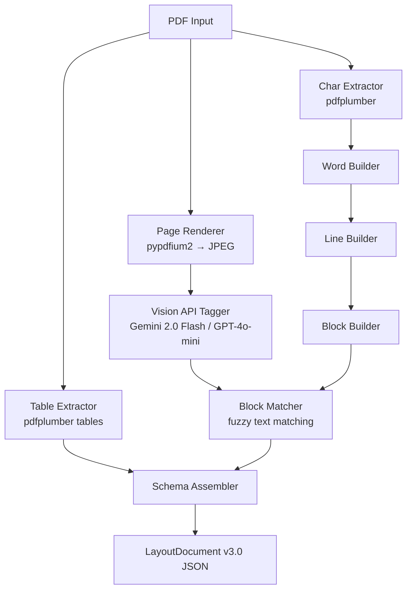

# ⚡ Fast Vision — SOTA PDF → Structured JSON Extractor

A high-accuracy PDF → structured JSON extraction pipeline that outputs **Layout and Tone Aware Document Schema v3.0**, combining deterministic PDF geometry (pixel-perfect bounding boxes) with Vision API semantic understanding (block classification, rhetoric analysis).

## Architecture



**Key design**: Deterministic geometry (pdfplumber chars → bboxes) provides pixel-perfect coordinates. Vision API provides SOTA semantic classification (block types, roles, reading order, rhetoric). The hybrid approach gives the best of both worlds.

## Quick Start

```bash
# 1. Create & activate virtual environment
python3 -m venv .venv
source .venv/bin/activate

# 2. Install
pip install -e .

# 3. Set API keys
cp .env.example .env
# Edit .env with your OpenAI or Gemini key

# 4. Run
python cli.py input.pdf -o output.json
```

## Usage

```bash
# With Vision API (SOTA accuracy — recommended)
python cli.py input.pdf -o output.json

# Geometry-only mode (no API needed, heuristic classification)
python cli.py input.pdf --no-vision -o output.json

# Specific pages only
python cli.py input.pdf --pages 1,3-5 -o output.json

# Verbose logging
python cli.py input.pdf -o output.json -v
```

## Output Schema v3.0

### Full JSON Schema

```json
{
  "document": {
    "document_id": "string — UUID",
    "schema_version": "string — always '3.0'",
    "source": "string — 'pdf' | 'docx' | 'html' | 'image'",
    "page_count": "integer — total pages in the document"
  },

  "pages": [
    {
      "page_number": "integer — 1-indexed page number",
      "width": "number — page width in points (1 pt = 1/72 inch)",
      "height": "number — page height in points",
      "rotation": "integer — 0 | 90 | 180 | 270 degrees",
      "unit": "string — 'pt' (points) or 'px' (pixels)"
    }
  ],

  "blocks": [
    {
      "id": "string — unique block identifier (UUID)",
      "type": "string — block classification (see Block Types below)",
      "role": "string — semantic role (see Roles below)",
      "page": "integer — which page this block belongs to (1-indexed)",
      "bbox": "[x0, y0, x1, y1] — absolute bounding box in points",
      "bbox_norm": "[x0, y0, x1, y1] — normalized bbox (0.0 to 1.0 relative to page)",
      "reading_order": "integer — natural reading sequence (0 = first block)",
      "z_index": "integer — stacking order for overlapping blocks (default 0)",
      "parent": "string|null — ID of parent block (for nested structures)",
      "children": "[string] — IDs of child blocks",
      "text": "string — extracted text content of this block",
      "style_id": "string — reference to a style in the 'styles' dict",
      "html": "string — semantic HTML snapshot, e.g. '<p>Hello world</p>'",
      "html_template": "string — template form, e.g. '<p>{{text}}</p>'",
      "rhetoric": {
        "tone": "string — 'formal' | 'neutral' | 'conversational' | 'legal' | 'compliance' | 'academic'",
        "voice": "string — 'active' | 'passive' | 'mixed'",
        "modality": "string — 'mandatory' | 'advisory' | 'descriptive'",
        "tense": "string — 'present' | 'past' | 'future' | 'mixed'",
        "domain": "string — 'legal' | 'banking' | 'technical' | 'general'"
      },
      "rhetoric_features": {
        "avg_sentence_length": "number — average words per sentence",
        "modal_density": "number — fraction of words that are modal verbs (shall, must, may, etc.)",
        "passive_ratio": "number — fraction of sentences in passive voice (0.0–1.0)",
        "legal_term_density": "number — fraction of legal/compliance terms (0.0–1.0)"
      }
    }
  ],

  "spans": [
    {
      "id": "string — unique span identifier",
      "block_id": "string — parent block ID",
      "text": "string — text content of this span",
      "bbox": "[x0, y0, x1, y1] — absolute bounding box",
      "bbox_norm": "[x0, y0, x1, y1] — normalized bounding box",
      "style_id": "string — reference to a style (for inline formatting changes)"
    }
  ],

  "tokens": [
    {
      "text": "string — individual word",
      "bbox": "[x0, y0, x1, y1] — exact word-level bounding box",
      "bbox_norm": "[x0, y0, x1, y1] — normalized word-level bounding box",
      "block_id": "string — which block this word belongs to",
      "span_id": "string — which span this word belongs to"
    }
  ],

  "tables": [
    {
      "id": "string — unique table identifier",
      "page": "integer — page number (1-indexed)",
      "rows": "integer — number of rows",
      "cols": "integer — number of columns",
      "bbox": "[x0, y0, x1, y1] — bounding box of entire table",
      "cells": [
        {
          "row": "integer — 0-indexed row position",
          "col": "integer — 0-indexed column position",
          "row_span": "integer — number of rows this cell spans (default 1)",
          "col_span": "integer — number of columns this cell spans (default 1)",
          "text": "string — cell text content",
          "bbox": "[x0, y0, x1, y1] — cell bounding box",
          "bbox_norm": "[x0, y0, x1, y1] — normalized cell bounding box",
          "style_id": "string — reference to a style"
        }
      ]
    }
  ],

  "styles": {
    "<style_id_hash>": {
      "font_family": "string — e.g. 'Arial', 'Times New Roman'",
      "size": "number — font size in points",
      "weight": "string — 'normal' | 'bold'",
      "italic": "boolean — true if italic",
      "underline": "boolean — true if underlined",
      "color": "string — hex color e.g. '#000000'",
      "align": "string — 'left' | 'center' | 'right' | 'justify'"
    }
  },

  "reading_graph": [
    {
      "from": "string — source block ID",
      "to": "string — target block ID",
      "relation": "string — 'next' | 'parent' | 'child' | 'caption_of'"
    }
  ]
}
```

### Key Explanations

#### Top-Level Keys

| Key | Meaning |
|-----|---------|
| `document` | **Metadata** about the document itself — unique ID, schema version (`3.0`), what format it came from (`pdf`), and how many pages it has |
| `pages` | **Physical dimensions** of each page in PDF points. Used to interpret absolute `bbox` coordinates and compute `bbox_norm` |
| `blocks` | **Core content** — every text region, heading, image, table, etc. detected on the page. Each block has coordinates, type classification, reading order, and rhetoric analysis |
| `spans` | **Inline runs** within blocks — a span boundary occurs wherever the font/style changes mid-paragraph (e.g., bold word inside normal text) |
| `tokens` | **Word-level granularity** — each individual word with its precise bounding box, linked back to its parent block and span |
| `tables` | **Structured tabular data** — row/column grid with per-cell text and bounding boxes. Detected via pdfplumber line-intersection algorithm |
| `styles` | **Deduplicated font styles** — each unique (font, size, weight, color) combination gets a 12-char SHA-256 hash ID. Blocks, spans, and cells reference these by `style_id` |
| `reading_graph` | **Reading flow** — directed edges between blocks representing the natural reading order. `"next"` means one block follows another |

#### Block Types

| Type | Meaning |
|------|---------|
| `heading` | Section or chapter heading (typically larger/bolder font) |
| `paragraph` | Normal body text content |
| `list_item` | A bullet point or numbered list entry |
| `table` | A placeholder block indicating a table exists at this position |
| `figure` | An image, chart, or diagram |
| `caption` | Descriptive text beneath a figure or table |
| `header` | Running header repeated at the top of pages |
| `footer` | Running footer repeated at the bottom of pages |
| `page_number` | Standalone page number text |
| `code_block` | Source code or preformatted monospace text |

#### Roles

| Role | Meaning |
|------|---------|
| `title` | Document-level title (usually page 1, largest text) |
| `section_title` | Major section heading (equivalent to H1/H2) |
| `subsection_title` | Sub-section heading (equivalent to H3+) |
| `paragraph` | Standard body paragraph |
| `list_item` | List entry |
| `table` | Table region |
| `figure` | Image/diagram region |
| `caption` | Caption for a figure or table |
| `header` | Page header content |
| `footer` | Page footer content |

#### Rhetoric Fields

| Field | Meaning |
|-------|---------|
| `tone` | Writing style — `formal` (professional), `neutral`, `conversational` (casual), `legal` (contracts), `compliance` (regulations), `academic` (research) |
| `voice` | `active` ("We require..."), `passive` ("It is required..."), or `mixed` |
| `modality` | `mandatory` (must/shall), `advisory` (should/may), or `descriptive` (states facts) |
| `tense` | Dominant verb tense — `present`, `past`, `future`, or `mixed` |
| `domain` | Subject area — `legal`, `banking`, `technical`, or `general` |

#### Rhetoric Features (Computed)

| Feature | Meaning |
|---------|---------|
| `avg_sentence_length` | Average number of words per sentence in this block. Higher = more complex prose |
| `modal_density` | Fraction of words that are modal verbs (shall, must, may, should, will, can, could, would, might). Higher = more prescriptive |
| `passive_ratio` | Fraction of sentences written in passive voice (0.0–1.0). Higher = more formal/legal style |
| `legal_term_density` | Fraction of words that are legal/compliance terms (0.0–1.0). Higher = more regulatory content |

#### Bounding Boxes

| Field | Meaning |
|-------|---------|
| `bbox` | `[x0, y0, x1, y1]` — **absolute** coordinates in PDF points. `(x0, y0)` = top-left corner, `(x1, y1)` = bottom-right corner. Origin is top-left of the page |
| `bbox_norm` | `[x0, y0, x1, y1]` — **normalized** to 0.0–1.0 by dividing by page width/height. Useful for rendering at any resolution |

#### Reading Graph Relations

| Relation | Meaning |
|----------|---------|
| `next` | Block A is immediately followed by Block B in natural reading order |
| `parent` | Block A is the parent container of Block B |
| `child` | Block A is a child of Block B |
| `caption_of` | Block A is a caption describing Block B (figure/table) |

## Project Structure

```
fast_vision/
├── cli.py                          # CLI entry point
├── pyproject.toml                  # Dependencies (all MIT/Apache 2.0)
├── .env.example                    # API key template
├── fast_vision/
│   ├── schema.py                   # Pydantic v2 models (Schema v3.0)
│   ├── pipeline.py                 # Main 6-step orchestrator
│   ├── geometry/
│   │   ├── char_extractor.py       # pdfplumber char extraction
│   │   ├── word_builder.py         # chars → words (gap clustering)
│   │   ├── line_builder.py         # words → lines (baseline alignment)
│   │   ├── block_builder.py        # lines → blocks (paragraph merging)
│   │   └── table_extractor.py      # Table detection + deduplication
│   ├── vision/
│   │   ├── page_renderer.py        # PDF → JPEG (pypdfium2)
│   │   ├── prompts.py              # Vision API system prompts
│   │   └── api_tagger.py           # Gemini/OpenAI parallel tagger
│   ├── merger/
│   │   ├── block_matcher.py        # Geometry ↔ semantic fuzzy matching
│   │   └── schema_assembler.py     # Final LayoutDocument assembly
│   └── styles/
│       └── style_normalizer.py     # SHA-256 style deduplication
└── tests/
    └── test_pipeline.py            # 18 tests (schema, imports, units)
```

## Dependencies

All **MIT** or **Apache 2.0** licensed — no heavy ML models required:

| Library | License | Purpose |
|---------|---------|---------|
| `pdfplumber` | MIT | Char extraction, table detection |
| `pypdfium2` | Apache 2.0 / BSD | PDF page rendering |
| `Pillow` | MIT (HPND) | Image handling |
| `pydantic` | MIT | Schema validation |
| `python-dotenv` | BSD | Environment file loading |
| `openai` | MIT | OpenAI API client |
| `google-genai` | Apache 2.0 | Gemini API client |

## Testing

```bash
source .venv/bin/activate
python -m pytest tests/ -v
```

**18/18 tests pass** covering schema validation, import chains, word building, style deduplication, and full document roundtrip serialization.

## API Keys

Set either (or both) in `.env`:

```env
OPENAI_API_KEY="sk-..."    # GPT-4o-mini (preferred)
GEMINI_API_KEY="AIza..."   # Gemini 2.0 Flash (fallback)
```

The pipeline prefers OpenAI if both are set, falls back to Gemini otherwise.
